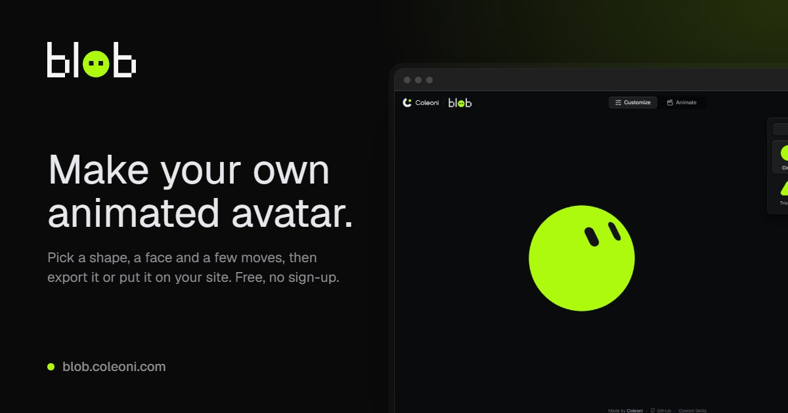

<p align="center">
  <picture>
    <source media="(prefers-color-scheme: dark)" srcset="public/brand/blob.svg">
    
  </picture>
</p>

<p align="center">
  Make your own animated blob avatar: pick a shape, an expression, a color and<br>
  animations, then export it or put it on your site. Free, no sign-up, all in your browser.
</p>

<p align="center">
  <a href="https://blob.coleoni.com"><b>blob.coleoni.com</b></a> ·
  <a href="https://blob.coleoni.com/pt/">Português</a> ·
  <a href="https://coleoni.com">Coleoni</a> ·
  <a href="https://skills.coleoni.com">Coleoni Skills</a> ·
  <a href="https://loaders.coleoni.com">Loaders</a>
</p>



## What you can make

- **12 shapes** in three rows: round (circle, pebble, squircle, capsule), geometric
  (triangle, diamond, hexagon, star) and organic (cloud, droplet, heart, ghost).
- **20 expressions**, from neutral and happy to worried, smug and sleepy.
- **Any color:** twelve swatches, or any other with the picker (a hex field, and an
  eyedropper where the browser has one).
- **14 animations** in a cycle of up to 24 clips, on a timeline that fits the whole
  cycle: drag to reorder (hold a moment first on a phone), drag the selected clip's
  edge to change its length (0.4 to 10 seconds), loop one clip, or do all of it
  from the keyboard. Any animation plays on the stage before you add it. Start from
  a template (hello, notify, thinking, sleepy, show) or from your own cycles, which
  you can name and are kept on your device. The cycle loops without a seam.
- **Exports:** PNG at 256, 512 or 1024 pixels, or any size from 16 to 2048; GIF (up
  to 512 pixels, 20 frames a second); still SVG; animated SVG. Transparent or on a
  solid background, square or round. The PNG and the SVG also copy straight to the
  clipboard.
- **An embed tag** for your own site (below).
- **A share link:** the whole avatar lives in the URL, so the address bar is always
  a link to it.

In Animate mode the GIF, the animated SVG and the embed code play your cycle; in
Customize mode they play the idle loop.

## On your site

```html
<script src="https://blob.coleoni.com/v2/embed.js" defer></script>

<blob-avatar shape="circle" color="#aefa0e" expression="happy"
             animation="idle.2.4,wink.1.6" size="160" gaze reaction></blob-avatar>
```

"Copy embed code", in the export menu, writes this tag for the blob you made, seed
included. Add `gaze` if you want it to follow the cursor, and `reaction` if a click
should make it wink and hop (the editor's settings add both for you).

The script's address carries its major version: `/v2/` stays on v2, so a new major
never changes a blob already on your page. `/embed.js` always serves the latest
version.

| Attribute | Values | Default |
| --- | --- | --- |
| `shape` | `circle` `pebble` `squircle` `capsule` `triangle` `diamond` `hexagon` `star` `cloud` `droplet` `heart` `ghost` | `circle` |
| `color` | a six-digit hex color, with or without `#` | `#aefa0e` |
| `expression` (or `expr`) | `neutral` `attentive` `focused` `surprised` `excited` `happy` `laughing` `wink` `angry` `sad` `worried` `scared` `suspicious` `confused` `curious` `proud` `smug` `shy` `unimpressed` `sleepy` | `neutral` |
| `animation` (or `anim`) | the cycle: up to 24 `name.seconds` items, comma separated, played in order. Names: `idle` `thinking` `wink` `wide` `alert` `notification` `exclaim` `sleep` `egg` `hexagon` `play` `orbit` `burst` `comet`. Seconds go from 0.4 to 10, one decimal; leave them out (`wink`) for the animation's own length | every animation once, in this order |
| `seed` | 1 to 6 characters of `0-9a-z`; changes when it blinks and where it glances | `1` |
| `size` | pixels, up to 4096 (or size the element with CSS) | `160` |
| `gaze` | no value: the eyes follow the cursor | off |
| `paused` | no value: holds still | off |
| `reaction` | no value: a click makes it wink and hop, while its cycle keeps playing. Or an animation's name, with seconds as in `animation` if you like (`exclaim`, `orbit.2`), to play that instead. With a `tabindex` on the element, Enter and Space work too | off |
| `state` | a whole share-link hash (`v=2&shape=…`); the attributes above override its parts | |

A value that is not on these lists is ignored, so the default (or the value from
`state`) stays, and an unknown name in `animation` is skipped.

Changing an attribute changes the blob right away. The element works under a strict
Content Security Policy (no inline styles, no `eval`), runs one animation loop for
every avatar on the page, draws only the ones on screen, and holds still for visitors
who prefer reduced motion (a click on a `reaction` avatar then shows the reaction's
pose for a moment, without moving). It has `role="img"` and the label "Blob avatar";
set `aria-label` to say something else. About 12 KB gzipped.

**Snippets and links from the first version** still open. The old shape names
(`orb` `bean` `block` `pill` `tri` `hex` `puff` `drop`) map to the new shapes, and
`ghost` and `star` are shapes again. The four expressions that are gone open as the
nearest ones (`joy` as laughing, `love` as happy, `starry` as excited, `dizzy` as
confused), and the other expressions and the animations that still exist keep
working. Everything else (`eyes`, `mode`, `eyec`, `bg`, the moves that are gone) is
ignored, so check old snippets against the table above.

## How it works

Everything is drawn from scratch, every frame, by a small engine with no
dependencies (`src/engine`).

- **One structure for every outline.** The body is a closed curve with a fixed
  number of points, each eye is another, and so are the dots and lines some
  animations add. Any shape turns into any other, and every path keeps the same
  commands, which is what lets the animated SVG hand its keyframes to the browser
  to interpolate.
- **The face lies on a sphere.** Each eye is a capsule on a sphere the size of the
  body, foreshortened near the rim. Turning the head moves the eyes over the
  sphere, so glances look right. Expressions are data: the size, place and turn of
  each eye.
- **Animations are functions of time.** Each clip says what the blob turns into and
  does at any moment of its length. The cycle crossfades from one clip to the next,
  and every period (breathing, blinking, glances) is fitted to the loop, so exports
  loop exactly.
- **`frame(state, t)` is pure:** the same avatar at the same moment is always the same
  picture, in the editor, in the GIF and on your site.

The GIF encoder is part of the project too: a median-cut palette, LZW compression
and frame differences, running in a Worker. The animated SVG drops every frame that
a straight line between its neighbors already explains.

## Develop

```bash
npm install
npm run dev      # http://localhost:5320
npm test
npm run check    # types
npm run build    # the site and embed.js (also at v2/embed.js), into dist/
```

`lab.html` shows every shape, expression, color and animation at once
(`?strip=orbit` shows one animation as 16 stills, `?freeze=1.2` stops everything at
1.2 seconds). `embed-test.html` runs `<blob-avatar>` under a strict CSP with every
shape and expression, each animation, the reaction and the edge cases (after a build).

## License

MIT © Coleoni. One of Coleoni's free tools, next to
[Coleoni Skills](https://skills.coleoni.com) and [Loaders](https://loaders.coleoni.com).
More at [coleoni.com](https://coleoni.com).
